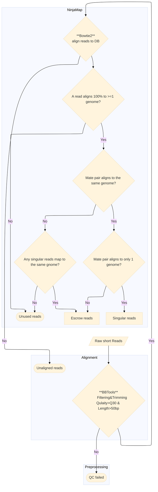

# nf-ninjaMap Workflow

```mermaid
---
config:
  layout: elk
  look:
  theme: base
---
flowchart TD
    reads[/Raw short Reads/]-->bbtools{**BBTools**
        Filtering&Trimming Qulaity>Q30 & Length>50bp}
    subgraph NinjaMap
        bowtie2 --> DB{A read aligns 100% to >=1 genome?}  
        DB --> | No | U([Unused reads])
        DB --> | Yes | Mate{Mate pair aligns to the same genome?}
        Mate --> | Yes |One{Mate pair aligns to only 1 genome?}
        One --> | Yes | S[Singular reads]
        One --> | No | E[Escrow reads]
        Mate --> | No | Same{Any singular reads map to the same gnome?}
        Same --> | Yes | E[Escrow reads]
        Same --> | No | U([Unused reads])
    end
    
    subgraph Alignment
        bbtools -->| Yes | bowtie2{**Bowtie2**
        align reads to DB}
        bowtie2 --> | No |Unaligned([Unaligned reads])
    end

    subgraph Preprocessing 
        bbtools -->| No | Failed([QC failed])
    
end
```